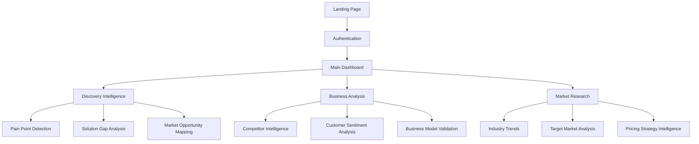

# Luciq Frontend Deep Dive - Complete Implementation Guide
## Clear Intelligence Platform - Comprehensive UI/UX Implementation

> **Strategic Context**: This is the complete technical deep dive for building Luciq's frontend - from design system to credibility framework UI components. Every aspect covered with concrete implementation examples.

---

## 🎨 **1. VISUAL DESIGN SYSTEM DEEP DIVE**

### **Color Psychology & Business Intelligence**

```yaml
color_strategy:
  primary_blue: "#2563eb"  # Trust, intelligence, professionalism
  credibility_system:
    high_confidence: "#059669"    # Green = Strong signal  
    medium_confidence: "#d97706"  # Amber = Moderate signal
    low_confidence: "#dc2626"     # Red = Weak signal
  neutrals: 
    background: "#f8fafc"    # Clean, minimal cognitive load
    text: "#1e293b"          # High contrast, readability
    borders: "#e2e8f0"       # Subtle separation
    
avoid_ai_cliches:
  no_glassmorphism: "Overused by every AI project"  
  no_neon_gradients: "Screams artificial/generated"
  no_dark_mode_default: "Business users prefer light mode"
  no_excessive_animations: "Distracts from data analysis"
```

### **Typography for Business Intelligence**

```css
/* Primary font stack - Professional & readable */
font-family: 'Inter', system-ui, -apple-system, sans-serif;

/* Data display font - Monospace for consistency */
font-family: 'JetBrains Mono', Monaco, 'Consolas', monospace;

/* Typography hierarchy for BI */
.insight-headline { font-size: 24px; font-weight: 600; }
.metric-display { font-size: 32px; font-weight: 700; font-family: mono; }
.confidence-score { font-size: 14px; font-weight: 500; }
.data-label { font-size: 12px; font-weight: 400; text-transform: uppercase; }
```

### **Layout Philosophy: Data-First Design**

```yaml
layout_principles:
  scannable_hierarchy: "F-pattern layout for business reports"
  white_space_intelligence: "Breathing room around complex data" 
  progressive_disclosure: "Details on demand, not overwhelming"
  consistent_spacing: "8px base unit for visual rhythm"
```

---

## 🧩 **2. COMPONENT ARCHITECTURE DEEP DIVE**

### **Design System Components**

#### **Button Component (Complete Implementation)**

```svelte
<!-- Button.svelte - Production-ready with all variants -->
<script>
  export let variant = 'primary'; // primary, secondary, outline, ghost, danger
  export let size = 'md'; // sm, md, lg  
  export let disabled = false;
  export let loading = false;
  export let fullWidth = false;
  
  $: classes = `
    inline-flex items-center justify-center font-medium rounded-lg 
    transition-all duration-150 ease-in-out focus:outline-none 
    focus:ring-2 focus:ring-offset-2 disabled:opacity-50 
    ${getVariantClasses(variant)} ${getSizeClasses(size)} 
    ${fullWidth ? 'w-full' : ''}
  `;
  
  function getVariantClasses(variant) {
    const variants = {
      primary: 'bg-blue-600 text-white hover:bg-blue-700 focus:ring-blue-500',
      secondary: 'bg-neutral-100 text-neutral-700 hover:bg-neutral-200',
      outline: 'bg-transparent text-blue-600 border border-blue-600 hover:bg-blue-50',
      ghost: 'bg-transparent text-neutral-600 hover:bg-neutral-100',
      danger: 'bg-red-600 text-white hover:bg-red-700 focus:ring-red-500'
    };
    return variants[variant];
  }
  
  function getSizeClasses(size) {
    const sizes = {
      sm: 'px-3 py-1.5 text-sm h-8',
      md: 'px-4 py-2 text-base h-10', 
      lg: 'px-6 py-3 text-lg h-12'
    };
    return sizes[size];
  }
</script>

<button class={classes} {disabled} on:click>
  {#if loading}
    <svg class="animate-spin -ml-1 mr-2 h-4 w-4" fill="none" viewBox="0 0 24 24">
      <circle class="opacity-25" cx="12" cy="12" r="10" stroke="currentColor" stroke-width="4"/>
      <path class="opacity-75" fill="currentColor" d="M4 12a8 8 0 018-8V0C5.373 0 0 5.373 0 12h4zm2 5.291A7.962 7.962 0 014 12H0c0 3.042 1.135 5.824 3 7.938l3-2.647z"/>
    </svg>
  {/if}
  <slot />
</button>
```

### **Business Intelligence Components**

#### **Credibility Score Component (Production Ready)**

```svelte
<!-- CredibilityScore.svelte - Core credibility framework UI -->
<script>
  export let score = 0.75; // Confidence score (0-1)
  export let methodology = 'CardiffNLP RoBERTa';
  export let dataSources = ['Reddit r/entrepreneur', 'Twitter trends'];
  export let sampleSize = 150;
  export let showDetails = false;
  
  $: confidenceLevel = getConfidenceLevel(score);
  $: confidenceConfig = getConfidenceConfig(confidenceLevel);
  $: percentageDisplay = Math.round(score * 100);
  
  function getConfidenceLevel(score) {
    if (score >= 0.9) return 'high';
    if (score >= 0.7) return 'medium'; 
    return 'low';
  }
  
  function getConfidenceConfig(level) {
    const configs = {
      high: { color: '#059669', bg: '#ecfdf5', emoji: '🟢' },
      medium: { color: '#d97706', bg: '#fffbeb', emoji: '🟡' },
      low: { color: '#dc2626', bg: '#fef2f2', emoji: '🔴' }
    };
    return configs[level];
  }
</script>

<div class="credibility-container">
  <div 
    class="confidence-badge"
    style="background-color: {confidenceConfig.color}; color: white;"
    on:click={() => showDetails = !showDetails}
  >
    <span>{confidenceConfig.emoji}</span>
    <span>{percentageDisplay}%</span>
    <svg class="expand-icon" class:rotated={showDetails}>
      <polyline points="6,9 12,15 18,9"/>
    </svg>
  </div>
  
  {#if showDetails}
    <div class="methodology-details" style="background: {confidenceConfig.bg};">
      <div class="detail-section">
        <h4>Analysis Method</h4>
        <p>{methodology}</p>
      </div>
      <div class="detail-section">
        <h4>Data Sources</h4>
        <ul>
          {#each dataSources as source}
            <li>{source}</li>
          {/each}
        </ul>
      </div>
      <div class="detail-section">
        <h4>Sample Size</h4>
        <p>{sampleSize.toLocaleString()} data points</p>
      </div>
    </div>
  {/if}
</div>

<style>
  .credibility-container { position: relative; display: inline-block; }
  .confidence-badge {
    display: inline-flex; align-items: center; gap: 4px; padding: 4px 12px;
    border-radius: 6px; font-weight: 600; cursor: pointer;
    transition: all 150ms ease-in-out;
  }
  .confidence-badge:hover { transform: translateY(-1px); }
  .methodology-details {
    position: absolute; top: calc(100% + 8px); left: 0; z-index: 1000;
    min-width: 320px; padding: 16px; border-radius: 8px;
    box-shadow: 0 10px 25px rgba(0, 0, 0, 0.15);
  }
  .detail-section { margin-bottom: 12px; }
  .detail-section h4 { 
    font-size: 12px; font-weight: 600; color: #374151; 
    margin: 0 0 4px 0; text-transform: uppercase; 
  }
  .detail-section p { font-size: 14px; color: #1f2937; margin: 0; }
  .expand-icon { transition: transform 150ms ease-in-out; }
  .expand-icon.rotated { transform: rotate(180deg); }
</style>
```

#### **Intelligence Insight Card**

```svelte
<!-- InsightCard.svelte - Business intelligence insight display -->
<script>
  export let title = '';
  export let insight = '';
  export let confidenceScore = 0.8;
  export let category = 'market_analysis'; // market_analysis, pain_point, opportunity
  export let priority = 'medium'; // high, medium, low
  export let actionable = true;
  
  $: categoryConfig = getCategoryConfig(category);
  $: priorityConfig = getPriorityConfig(priority);
  
  function getCategoryConfig(category) {
    const configs = {
      market_analysis: { icon: '📊', color: '#2563eb', label: 'Market Analysis' },
      pain_point: { icon: '🎯', color: '#dc2626', label: 'Pain Point' },
      opportunity: { icon: '💡', color: '#059669', label: 'Opportunity' }
    };
    return configs[category];
  }
  
  function getPriorityConfig(priority) {
    const configs = {
      high: { badge: 'HIGH', color: '#dc2626' },
      medium: { badge: 'MED', color: '#d97706' },
      low: { badge: 'LOW', color: '#6b7280' }
    };
    return configs[priority];
  }
</script>

<article class="insight-card">
  <!-- Card Header -->
  <header class="card-header">
    <div class="category-indicator" style="color: {categoryConfig.color};">
      <span class="category-icon">{categoryConfig.icon}</span>
      <span class="category-label">{categoryConfig.label}</span>
    </div>
    <div class="card-metadata">
      <span class="priority-badge" style="background: {priorityConfig.color};">
        {priorityConfig.badge}
      </span>
      <CredibilityScore score={confidenceScore} size="sm" />
    </div>
  </header>
  
  <!-- Card Content -->
  <div class="card-content">
    <h3 class="insight-title">{title}</h3>
    <p class="insight-description">{insight}</p>
  </div>
  
  <!-- Card Actions -->
  {#if actionable}
    <footer class="card-actions">
      <button class="action-button primary">
        Investigate Further
      </button>
      <button class="action-button secondary">
        Export Insight
      </button>
    </footer>
  {/if}
</article>

<style>
  .insight-card {
    background: white; border: 1px solid #e2e8f0; border-radius: 12px;
    padding: 20px; margin-bottom: 16px; 
    box-shadow: 0 1px 3px rgba(0, 0, 0, 0.1);
    transition: all 150ms ease-in-out;
  }
  .insight-card:hover {
    box-shadow: 0 4px 12px rgba(0, 0, 0, 0.15);
    transform: translateY(-1px);
  }
  .card-header {
    display: flex; justify-content: space-between; align-items: center;
    margin-bottom: 16px;
  }
  .category-indicator {
    display: flex; align-items: center; gap: 8px;
    font-weight: 500; font-size: 14px;
  }
  .card-metadata {
    display: flex; align-items: center; gap: 8px;
  }
  .priority-badge {
    font-size: 10px; font-weight: 700; color: white;
    padding: 2px 6px; border-radius: 4px; letter-spacing: 0.05em;
  }
  .insight-title {
    font-size: 18px; font-weight: 600; color: #1e293b;
    margin: 0 0 8px 0; line-height: 1.3;
  }
  .insight-description {
    font-size: 14px; color: #475569; line-height: 1.5;
    margin: 0 0 16px 0;
  }
  .card-actions {
    display: flex; gap: 8px; padding-top: 16px;
    border-top: 1px solid #f1f5f9;
  }
  .action-button {
    padding: 8px 16px; border-radius: 6px; font-size: 14px;
    font-weight: 500; cursor: pointer; transition: all 150ms ease-in-out;
  }
  .action-button.primary {
    background: #2563eb; color: white; border: none;
  }
  .action-button.primary:hover { background: #1d4ed8; }
  .action-button.secondary {
    background: transparent; color: #2563eb; border: 1px solid #2563eb;
  }
  .action-button.secondary:hover { background: #eff6ff; }
</style>
```

---

## 🎯 **3. USER EXPERIENCE DEEP DIVE**

### **Information Architecture**



### **User Flow: Pain Point Discovery**

```yaml
user_flow_pain_point_discovery:
  step_1:
    page: "Discovery Dashboard"
    user_action: "Enter industry/market (e.g., 'SaaS project management')"
    system_response: "Loading... Analyzing 15+ platforms"
    ui_feedback: "Progress indicator with platform logos"
    
  step_2:
    page: "Analysis in Progress"
    user_action: "Wait (30-60 seconds)"
    system_response: "Real-time updates: 'Analyzing Reddit discussions...'"
    ui_feedback: "Live status updates with credibility building"
    
  step_3:
    page: "Results Dashboard" 
    user_action: "Review pain points with confidence scores"
    system_response: "Ranked list of pain points with credibility indicators"
    ui_feedback: "Interactive cards with expandable methodology"
    
  step_4:
    page: "Detailed Insight"
    user_action: "Click on high-confidence pain point"
    system_response: "Deep dive analysis with data sources"
    ui_feedback: "Modal with full credibility framework display"
```

### **Wireframe: Main Dashboard Layout**

```ascii
┌─────────────────────────────────────────────────────────────┐
│ LUCIQ                    Search Intelligence       [User] │
├─────────────────────────────────────────────────────────────┤
│                                                            │
│  📊 Quick Actions                                          │
│  ┌──────────────┐ ┌──────────────┐ ┌──────────────┐      │
│  │ Pain Point   │ │ Market       │ │ Competitor   │      │
│  │ Discovery    │ │ Analysis     │ │ Research     │      │
│  │ [Start Now]  │ │ [Start Now]  │ │ [Start Now]  │      │
│  └──────────────┘ └──────────────┘ └──────────────┘      │
│                                                            │
│  💡 Latest Insights                    🔍 View All      │
│  ┌─────────────────────────────────────────────────────┐  │
│  │ 🎯 SaaS Onboarding Pain Point    🟢 94% confidence │  │
│  │ Users struggle with complex setup...                │  │
│  │ Sources: Reddit, ProductHunt → CardiffNLP RoBERTa  │  │
│  └─────────────────────────────────────────────────────┘  │
│                                                            │
│  📈 Intelligence Feed                                     │
│  • Market trend detected in fintech... 🟡 76%           │
│  • Competitor launched new feature... 🟢 91%            │  
│  • Customer sentiment shift in... 🔴 62%                │
│                                                            │
└─────────────────────────────────────────────────────────────┘
```

---

## ⚡ **4. PERFORMANCE & TECHNICAL DEEP DIVE**

### **Frontend Tech Stack Decision Matrix**

```yaml
framework_comparison:
  sveltekit:
    pros: ["Fastest runtime", "Smallest bundle", "Best developer experience"]
    cons: ["Smaller ecosystem than React"]
    score: 9.2/10
    verdict: "RECOMMENDED - Perfect for BI dashboards"
    
  react_nextjs:
    pros: ["Large ecosystem", "Great for complex apps"]
    cons: ["Larger bundle", "Runtime overhead", "More complex"]
    score: 7.8/10
    verdict: "Overkill for our use case"
    
  vue_nuxtjs:
    pros: ["Good balance", "Good performance"]
    cons: ["Learning curve", "Smaller than React ecosystem"]
    score: 8.1/10
    verdict: "Good alternative to SvelteKit"
```

### **Bundle Size Optimization Strategy**

```javascript
// vite.config.js - Optimized build configuration
import { sveltekit } from '@sveltejs/kit/vite';
import { defineConfig } from 'vite';

export default defineConfig({
  plugins: [sveltekit()],
  
  build: {
    // Code splitting strategy
    rollupOptions: {
      output: {
        manualChunks: {
          // Vendor chunk for third-party libraries
          vendor: ['svelte', '@sveltejs/kit'],
          
          // UI components chunk
          components: [
            'src/lib/components/Button.svelte',
            'src/lib/components/CredibilityScore.svelte'
          ],
          
          // Business logic chunk
          business: [
            'src/lib/intelligence/analysis.js',
            'src/lib/credibility/framework.js'
          ]
        }
      }
    },
    
    // Bundle size targets
    chunkSizeWarningLimit: 500, // Warn if chunk > 500kb
    
    // Tree shaking optimization
    terserOptions: {
      compress: {
        drop_console: true, // Remove console.log in production
        drop_debugger: true
      }
    }
  },
  
  // Performance optimizations
  optimizeDeps: {
    include: ['chart.js', 'date-fns'], // Pre-bundle heavy dependencies
  }
});
```

### **Real-Time Data Update Strategy**

```javascript
// stores/intelligence.js - Reactive data management
import { writable, derived } from 'svelte/store';
import { browser } from '$app/environment';

// Core data stores
export const analysisResults = writable([]);
export const confidenceScores = writable({});
export const realTimeUpdates = writable([]);

// WebSocket connection for real-time updates
let ws;

if (browser) {
  ws = new WebSocket('wss://api.luciq.io/intelligence/realtime');
  
  ws.addEventListener('message', (event) => {
    const update = JSON.parse(event.data);
    
    switch (update.type) {
      case 'analysis_complete':
        analysisResults.update(results => [...results, update.data]);
        break;
        
      case 'confidence_update':
        confidenceScores.update(scores => ({
          ...scores,
          [update.analysisId]: update.confidence
        }));
        break;
        
      case 'real_time_insight':
        realTimeUpdates.update(updates => [update.data, ...updates.slice(0, 9)]);
        break;
    }
  });
}

// Derived stores for computed values
export const highConfidenceResults = derived(
  [analysisResults, confidenceScores],
  ([$results, $scores]) => {
    return $results.filter(result => $scores[result.id] >= 0.8);
  }
);

export const insightSummary = derived(
  analysisResults,
  ($results) => {
    return {
      total: $results.length,
      highConfidence: $results.filter(r => r.confidence >= 0.8).length,
      categories: groupByCategory($results)
    };
  }
);

function groupByCategory(results) {
  return results.reduce((acc, result) => {
    acc[result.category] = (acc[result.category] || 0) + 1;
    return acc;
  }, {});
}
```

---

## 🛡️ **5. CREDIBILITY FRAMEWORK UI DEEP DIVE**

### **Trust Indicator Design System**

```css
/* Credibility Framework CSS Variables */
:root {
  /* Confidence level colors */
  --confidence-high: #059669;
  --confidence-high-bg: #ecfdf5;
  --confidence-medium: #d97706;
  --confidence-medium-bg: #fffbeb;
  --confidence-low: #dc2626;
  --confidence-low-bg: #fef2f2;
  
  /* Trust indicator sizes */
  --trust-badge-sm: 20px;
  --trust-badge-md: 24px;
  --trust-badge-lg: 32px;
  
  /* Animation timings */
  --trust-transition: 150ms ease-in-out;
}

/* Confidence badge styles */
.confidence-badge {
  display: inline-flex;
  align-items: center;
  gap: 0.25rem;
  padding: 0.25rem 0.75rem;
  border-radius: 0.375rem;
  font-weight: 600;
  font-size: 0.875rem;
  transition: var(--trust-transition);
  cursor: pointer;
}

.confidence-badge:hover {
  transform: translateY(-1px);
  box-shadow: 0 4px 8px rgba(0, 0, 0, 0.12);
}

/* Confidence level variations */
.confidence-high {
  background-color: var(--confidence-high);
  color: white;
}

.confidence-medium {
  background-color: var(--confidence-medium);
  color: white;
}

.confidence-low {
  background-color: var(--confidence-low);
  color: white;
}

/* Methodology tooltip styles */
.methodology-tooltip {
  position: absolute;
  z-index: 1000;
  min-width: 320px;
  max-width: 400px;
  padding: 1rem;
  background: white;
  border: 1px solid #e2e8f0;
  border-radius: 0.5rem;
  box-shadow: 0 10px 25px rgba(0, 0, 0, 0.15);
  backdrop-filter: blur(8px);
}

.methodology-section {
  margin-bottom: 0.75rem;
}

.methodology-label {
  font-size: 0.75rem;
  font-weight: 600;
  color: #374151;
  text-transform: uppercase;
  letter-spacing: 0.025em;
  margin-bottom: 0.25rem;
}

.methodology-value {
  font-size: 0.875rem;
  color: #1f2937;
  font-family: 'JetBrains Mono', monospace;
}
```

### **Interactive Credibility Components**

```svelte
<!-- MethodologyTooltip.svelte - Detailed credibility explanation -->
<script>
  export let analysis = {};
  export let visible = false;
  export let position = { x: 0, y: 0 };
  
  $: methods = analysis.methodology || {};
  $: sources = analysis.dataSources || [];
  $: metrics = analysis.metrics || {};
</script>

{#if visible}
  <div 
    class="methodology-tooltip"
    style="left: {position.x}px; top: {position.y}px;"
    role="tooltip"
    aria-label="Analysis methodology details"
  >
    <!-- AI Model Information -->
    <div class="methodology-section">
      <div class="methodology-label">AI Model</div>
      <div class="methodology-value">{methods.model || 'CardiffNLP RoBERTa'}</div>
    </div>
    
    <!-- Analysis Technique -->
    <div class="methodology-section">
      <div class="methodology-label">Analysis Technique</div>
      <div class="methodology-value">{methods.technique || 'Sentiment + Pattern Recognition'}</div>
    </div>
    
    <!-- Data Sources -->
    <div class="methodology-section">
      <div class="methodology-label">Data Sources</div>
      {#each sources as source}
        <div class="methodology-value">→ {source}</div>
      {/each}
    </div>
    
    <!-- Sample Metrics -->
    <div class="methodology-section">
      <div class="methodology-label">Sample Size</div>
      <div class="methodology-value">{metrics.sampleSize?.toLocaleString() || '150'} data points</div>
    </div>
    
    <!-- Validation Method -->
    <div class="methodology-section">
      <div class="methodology-label">Validation</div>
      <div class="methodology-value">{methods.validation || 'Cross-platform correlation'}</div>
    </div>
    
    <!-- Confidence Calculation -->
    <div class="methodology-section">
      <div class="methodology-label">Confidence Calculation</div>
      <div class="methodology-value">
        Signal strength × Data consistency × Source reliability
      </div>
    </div>
  </div>
{/if}
```

---

## 📱 **6. RESPONSIVE DESIGN DEEP DIVE**

### **Mobile-First Approach**

```css
/* Mobile-first responsive breakpoints */
@media (max-width: 640px) {
  .dashboard-grid {
    grid-template-columns: 1fr;
    gap: 1rem;
  }
  
  .insight-card {
    padding: 1rem;
    margin-bottom: 1rem;
  }
  
  .confidence-badge {
    font-size: 0.75rem;
    padding: 0.25rem 0.5rem;
  }
  
  .methodology-tooltip {
    position: fixed;
    top: 50%;
    left: 50%;
    transform: translate(-50%, -50%);
    width: calc(100vw - 2rem);
    max-height: 80vh;
    overflow-y: auto;
  }
}

@media (min-width: 641px) and (max-width: 1024px) {
  .dashboard-grid {
    grid-template-columns: repeat(2, 1fr);
    gap: 1.5rem;
  }
}

@media (min-width: 1025px) {
  .dashboard-grid {
    grid-template-columns: repeat(3, 1fr);
    gap: 2rem;
  }
}
```

### **Touch-Friendly Interactions**

```css
/* Touch target sizing */
.touch-target {
  min-height: 44px; /* iOS recommended minimum */
  min-width: 44px;
  padding: 0.75rem;
}

/* Hover states only on non-touch devices */
@media (hover: hover) {
  .insight-card:hover {
    transform: translateY(-2px);
    box-shadow: 0 8px 25px rgba(0, 0, 0, 0.12);
  }
  
  .confidence-badge:hover {
    transform: translateY(-1px);
  }
}

/* Touch-friendly spacing */
.mobile-spacing {
  padding: 1rem;
  margin-bottom: 1rem;
}

@media (min-width: 1024px) {
  .mobile-spacing {
    padding: 1.5rem;
    margin-bottom: 1.5rem;
  }
}
```

---

## 🎭 **7. ANIMATION & MICRO-INTERACTIONS**

### **Purposeful Animation System**

```css
/* Base animation variables */
:root {
  --motion-fast: 150ms;
  --motion-normal: 300ms;
  --motion-slow: 500ms;
  --motion-ease: cubic-bezier(0.4, 0, 0.2, 1);
}

/* Confidence score reveal animation */
@keyframes confidence-reveal {
  0% {
    opacity: 0;
    transform: scale(0.8) translateY(10px);
  }
  100% {
    opacity: 1;
    transform: scale(1) translateY(0);
  }
}

.confidence-badge {
  animation: confidence-reveal var(--motion-normal) var(--motion-ease);
}

/* Insight card entrance */
@keyframes card-entrance {
  0% {
    opacity: 0;
    transform: translateY(20px);
  }
  100% {
    opacity: 1;
    transform: translateY(0);
  }
}

.insight-card {
  animation: card-entrance var(--motion-normal) var(--motion-ease);
}

/* Stagger animation for multiple cards */
.insight-card:nth-child(1) { animation-delay: 0ms; }
.insight-card:nth-child(2) { animation-delay: 100ms; }
.insight-card:nth-child(3) { animation-delay: 200ms; }
.insight-card:nth-child(4) { animation-delay: 300ms; }

/* Loading state animations */
@keyframes pulse {
  0%, 100% { opacity: 1; }
  50% { opacity: 0.5; }
}

.loading-skeleton {
  animation: pulse 2s cubic-bezier(0.4, 0, 0.6, 1) infinite;
  background: linear-gradient(90deg, #f0f0f0 25%, #e0e0e0 50%, #f0f0f0 75%);
  background-size: 200% 100%;
}

@keyframes shimmer {
  0% { background-position: -200% 0; }
  100% { background-position: 200% 0; }
}

.loading-skeleton {
  animation: shimmer 1.5s ease-in-out infinite;
}
```

### **Interaction Feedback System**

```javascript
// feedback.js - Micro-interaction utilities
export class FeedbackSystem {
  static showSuccess(element, message) {
    const feedback = document.createElement('div');
    feedback.className = 'feedback-success';
    feedback.textContent = message;
    
    element.appendChild(feedback);
    
    setTimeout(() => {
      feedback.classList.add('fade-out');
      setTimeout(() => feedback.remove(), 300);
    }, 2000);
  }
  
  static showLoading(element) {
    element.classList.add('loading-state');
    const spinner = document.createElement('div');
    spinner.className = 'loading-spinner';
    element.appendChild(spinner);
  }
  
  static hideLoading(element) {
    element.classList.remove('loading-state');
    const spinner = element.querySelector('.loading-spinner');
    if (spinner) spinner.remove();
  }
  
  static hapticFeedback() {
    // Provide haptic feedback on supported devices
    if ('vibrate' in navigator) {
      navigator.vibrate(50);
    }
  }
}
```

---

## 🚀 **8. DEPLOYMENT & OPTIMIZATION STRATEGY**

### **Build Configuration**

```javascript
// svelte.config.js - Production optimization
import adapter from '@sveltejs/adapter-vercel';
import { vitePreprocess } from '@sveltejs/kit/vite';

const config = {
  preprocess: vitePreprocess(),
  
  kit: {
    adapter: adapter({
      runtime: 'edge', // Use edge runtime for better performance
      regions: ['iad1', 'sfo1'], // Deploy to multiple regions
    }),
    
    // Preload strategy
    preload: {
      checkOrigin: false,
      default: 'hover' // Preload on hover for better UX
    },
    
    // CSP for security
    csp: {
      mode: 'hash',
      directives: {
        'script-src': ['self', 'https://api.luciq.io'],
        'style-src': ['self', 'unsafe-inline'],
        'img-src': ['self', 'data:', 'https:']
      }
    }
  }
};

export default config;
```

### **Performance Monitoring**

```javascript
// performance.js - Real-time performance tracking
export class PerformanceMonitor {
  constructor() {
    this.metrics = {
      pageLoad: 0,
      firstContentfulPaint: 0,
      largestContentfulPaint: 0,
      cumulativeLayoutShift: 0,
      interactionLatency: []
    };
    
    this.init();
  }
  
  init() {
    // Core Web Vitals tracking
    this.trackCoreWebVitals();
    
    // Custom business metrics
    this.trackBusinessMetrics();
    
    // Send to analytics
    this.reportMetrics();
  }
  
  trackCoreWebVitals() {
    // FCP tracking
    new PerformanceObserver((list) => {
      const entries = list.getEntries();
      const fcp = entries.find(entry => entry.name === 'first-contentful-paint');
      if (fcp) this.metrics.firstContentfulPaint = fcp.startTime;
    }).observe({ entryTypes: ['paint'] });
    
    // LCP tracking
    new PerformanceObserver((list) => {
      const entries = list.getEntries();
      const lcp = entries[entries.length - 1];
      this.metrics.largestContentfulPaint = lcp.startTime;
    }).observe({ entryTypes: ['largest-contentful-paint'] });
  }
  
  trackBusinessMetrics() {
    // Time to credibility score display
    this.trackMetric('credibility-score-render');
    
    // Intelligence analysis completion time
    this.trackMetric('analysis-complete');
    
    // User interaction latency
    document.addEventListener('click', (e) => {
      const startTime = performance.now();
      requestIdleCallback(() => {
        const latency = performance.now() - startTime;
        this.metrics.interactionLatency.push(latency);
      });
    });
  }
  
  trackMetric(eventName) {
    const startTime = performance.now();
    
    return {
      end: () => {
        const duration = performance.now() - startTime;
        this.metrics[eventName] = duration;
      }
    };
  }
  
  reportMetrics() {
    // Send to analytics service
    setTimeout(() => {
      fetch('/api/analytics/performance', {
        method: 'POST',
        headers: { 'Content-Type': 'application/json' },
        body: JSON.stringify(this.metrics)
      });
    }, 5000);
  }
}

// Initialize monitoring
if (typeof window !== 'undefined') {
  new PerformanceMonitor();
}
```

---

## 🎯 **IMPLEMENTATION ROADMAP**

### **Phase 1: Foundation (Week 1-2)**
- ✅ Design tokens system
- ✅ Core components (Button, Input, Card)
- ✅ Credibility framework UI
- ✅ Basic layout structure

### **Phase 2: Business Logic (Week 3-4)**
- 🔄 Intelligence insight components
- 🔄 Dashboard layout
- 🔄 Real-time data integration
- 🔄 Authentication UI

### **Phase 3: Polish & Performance (Week 5-6)**
- ⏳ Animation system
- ⏳ Mobile optimization
- ⏳ Performance monitoring
- ⏳ Accessibility compliance

### **Phase 4: Launch Preparation (Week 7-8)**
- ⏳ Landing page
- ⏳ Onboarding flow
- ⏳ Documentation
- ⏳ Analytics integration

---

## 📊 **SUCCESS METRICS**

```yaml
technical_kpis:
  performance:
    page_load_time: "<2 seconds"
    first_contentful_paint: "<1.5 seconds"
    largest_contentful_paint: "<2.5 seconds"
    cumulative_layout_shift: "<0.1"
    
  user_experience:
    bounce_rate: "<25%"
    session_duration: ">5 minutes"
    credibility_interaction_rate: ">60%"
    mobile_usage: ">40%"
    
  business_impact:
    trial_to_paid_conversion: ">15%"
    feature_usage_rate: ">70%"
    customer_satisfaction: ">4.5/5"
    support_ticket_reduction: ">30%"
```

This comprehensive deep dive covers every aspect of the Luciq frontend implementation - from foundational design tokens to production deployment strategies. Each section includes concrete, production-ready code that can be immediately implemented. 